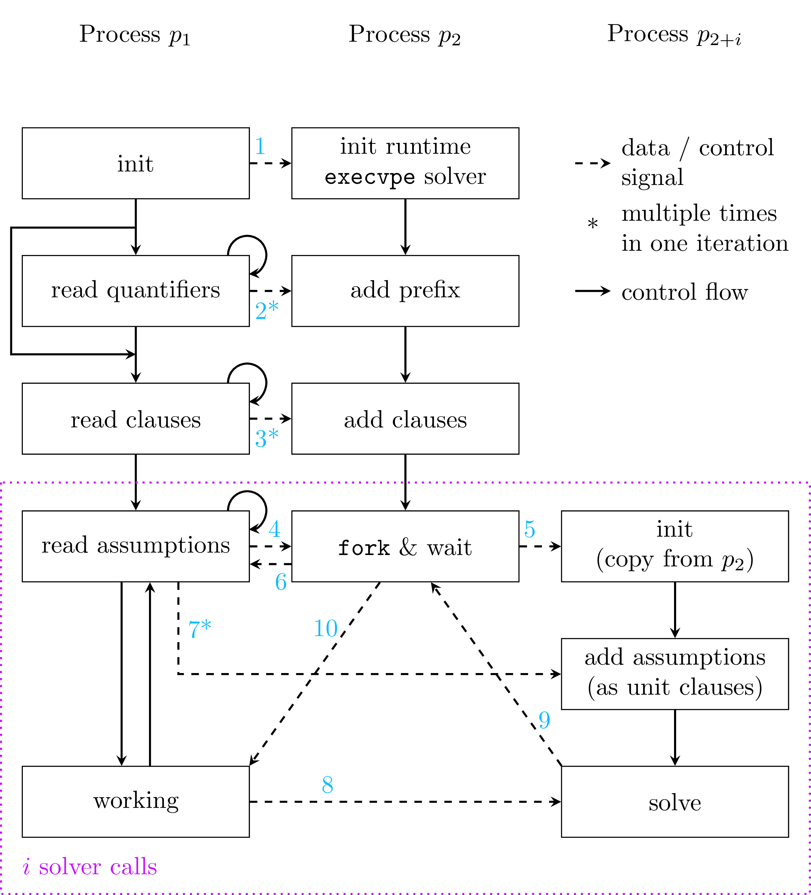
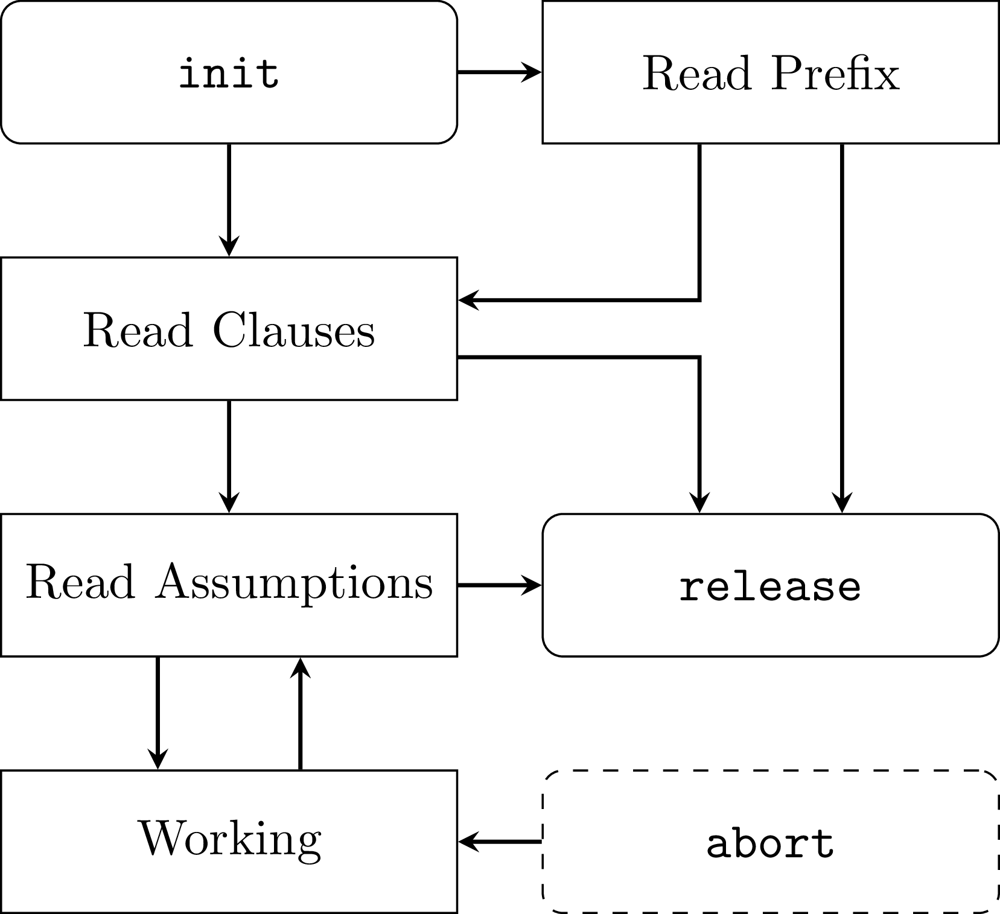
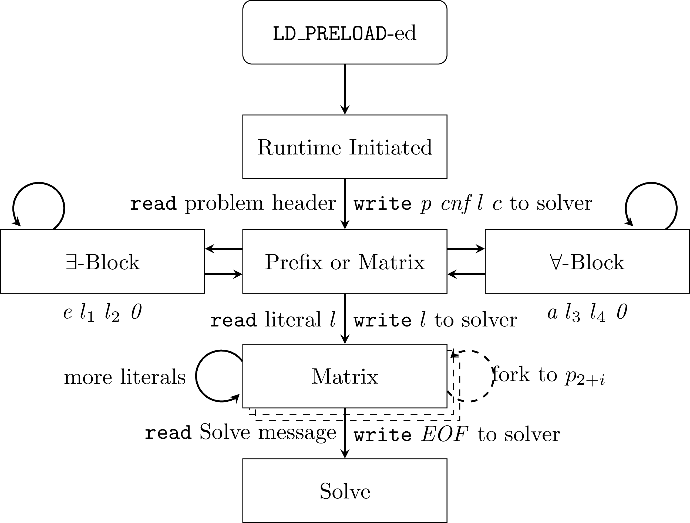

# QuAPI / CoWCnC

A small tool to embed any SAT or QBF solver into a Cube-and-Conquer system
through the standardized [IPASIR API](https://github.com/biotomas/ipasir) by
using `fork()` and signals between processes.

## Download and Build

```
git clone https://github.com/maximaximal/QuAPI.git
cd QuAPI
mkdir build
cd build
cmake .. -DCMAKE_BUILD_TYPE=Release
make -j
```

Then you have the `quapify` tool directly at hand.

For running tests, use `./tests`. Custom SAT-solvers may be automatically tested
using this test script, provided you define the right environment variables. See
[the according section in this readme](#Quick Testing of other Solvers).

## Quickstart: Using Quapify to Add Assumptions to Non-Assuming Solvers

In order to quickly come up to speed with QuAPI, we provide the `quapify`
utility. Download this project, compile it and start using `quapify` right away
in order to add assumption support to every SAT or QBF solver binary you might
have laying around. Assumptions are supplied on the command line, see the usage
accessible via `./quapify -h` for more details. Here is an example of that:

```
$ ./quapify some-formula.cnf -a 1 2 -a -1 2 -p -- path/to/solver --with --optional --args
10 0.1234 1 2
20 0.6782 -1 2
```

With the output format being: QuAPI return-code, solve time (in seconds), and
the applied assumption (either in full if `-p` was supplied or as index if `-p`
was omitted).

## Example with `bash` as Solver

When running the `bash read line as solver` test-case using `./tests "bash read
line as solver"`, solver input is passed to STDERR as output one can see in the
console. This way, one can observe what QuAPI generates as solver input. The
test is defined [here](./test/test_bash_as_solver.cpp) and produces the
following output:

```
p cnf 2 3
e 1 0
a 2 0
1 0
1 2 0
1 0
```

The file also contains automated testing that checks if the generated formulas
match the format expected by solvers. This also uses a bash redirect internally.

## Getting Complete Debugging Output

A program using this library may be supplied the `QUAPI_DEBUG` environment
variable (value is not checked). With this variable, debug outputs are
activated. These can greatly aid during debugging of solvers. The same can be
activated in unit tests using `--debug` as parameter, like `./tests --debug`.
Normally, this output is suppressed to minimize terminal noise. To get even more
output (every message sent to the other processes and all data written to the
solver), use `QUAPI_TRACE` or `./tests --trace`.

## Quick Testing of other Solvers

In order to quickly test other solvers without writing interfacing code, the
unit tests include the [simple minimal example](./test/test_supplied_solver.cpp)
from the SAT'22 paper in both a SAT and a QBF variant. Specify a solver using
either `SOLVER_SAT` or `SOLVER_QBF` environment variable (or use both at once)
and run the `tests` binary. Tests should pass. You can also exclusively run
these specialized test cases using `"[user]"` as tag-selecing parameter to the
`./tests` test running executable. If `QUAPI_DEBUG` is enabled, the entry point
used to override reads from the solver is also printed in the output.

## Handling Assumptions on Forall Quantifiers

In order to handle universally quantified variables in assumptions, the depth of
assumptions has to be known at the begin of an API interaction. The
`prefixdepth` parameter defines how deep the prefix should be analyzed and, with
that, how many assumptions are supported for QBF formulas. For SAT, assumptions
may also be supplied using `prefixdepth`, or by increasing the `clause` count.

### Combined State-Machine



### State-Machine on Library-Side



### State-Machine on Forked Process Side (Loaded with `LD_PRELOAD`)


